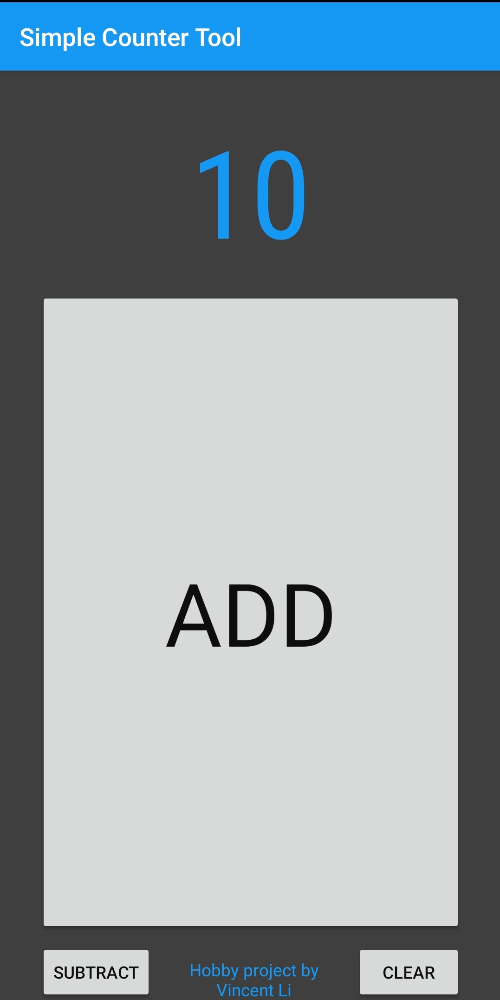
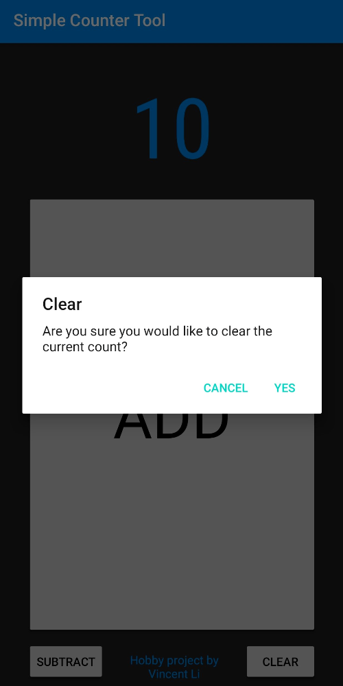

<h1>SimpleCounterTool</h1>

This is a very simple Android application.  It's purpose is a counter tool, such as a pitch counter for baseball.

<h2>Practical/Design Features</h2>
<ul>
    <li>Firebase integration for analytics</li>
    <li>AdMob integration for banner ads and monetization</li>
    <li>Incorporating native (C++) code for back-end</li>
</ul>
<h2>Screenshots</h2>

